# Hi, I'm Yanying Zhang 👋

**CS student at McGill University** — Machine Learning · Full-Stack Software Engineering  
Outside of tech: nature photography, multi-media painting, and creative writing.

Currently working on: CNN image classifiers, NLP pipelines, full-stack web apps  
Learning: BERT fine-tuning, MLOps, cloud deployment, system design  
Open to: ML Engineer / Software Engineer internships and entry-level roles

## Tech Stack

| Area | Tools |
|------|-------|
| ML / Deep Learning | PyTorch, TensorFlow, scikit-learn, Naive Bayes, BERT |
| Frontend | React, Next.js, Vite, TypeScript, HTML5, CSS3, JavaScript |
| Backend | Django, Django REST Framework, PostgreSQL, Stripe, Celery, Redis |
| Systems | C, pthreads, Linux, POSIX |
| Cloud | Google Cloud Run, Cloudflare Workers, Vercel, Docker |

## Projects

### Web Applications

| Project | Stack | Highlights |
|---------|-------|------------|
| [ValleyRain — Mobile Massage Booking Platform](https://in-home-massage.vercel.app/#/) | React 19, TypeScript, Django 5, PostgreSQL, Stripe, Vite 8, Google Cloud Run | Full-stack bilingual (EN/FR) booking platform for in-home massage in Greater Montreal. Online booking, Stripe payments, gift cards, passwordless auth, admin dashboard, therapist onboarding, role-based access (dev/admin/therapist/member/guest), Celery + Redis async tasks, Sentry monitoring. |
| [Canada Reference-Free Health Test Finder](https://ref-free-health.vercel.app/) | Next.js, React, Vercel | Conçu principalement pour les francophones du Québec. Agrège des examens médicaux auto-payants au Canada et aux États-Unis — aucune lettre de référence requise. Recherche par mot-clé, filtres avancés (type de test, région, prix, délai), et fiches complètes avec politiques et restrictions par clinique. |

### Machine Learning & AI — [`ml-ai-projects/`](ml-ai-projects/)

| Project | Stack | Highlights |
|---------|-------|------------|
| [CNN Image Classification — CIFAR-10](ml-ai-projects/PyTorch_Tensorflow_CNN/) | PyTorch, TensorFlow | Hyperparameter tuning, regularisation comparison, LaTeX report with confusion matrices |
| [Power Plant Output Prediction](ml-ai-projects/ML_modeling_predict_electrical_energy/) | Python, scikit-learn | Linear Regression vs Random Forest on 4,223 instances; Temperature as strongest predictor |
| [NLP: Naive Bayes + BERT](ml-ai-projects/Native_Bayes_BERT/) | Python, BERT, Jupyter | Classical vs transformer-based text classification |
| [Bankruptcy Regression Analysis](ml-ai-projects/QualitativeBankruptcy_RregressionAnalysis/) | Python | Logistic regression with mini-batch SGD; learning curve analysis |

### Data Analysis — [`data-analysis/`](data-analysis/)

| Project | Stack | Highlights |
|---------|-------|------------|
| [Insurance Data Analytics](data-analysis/insurance_textual_data_analytics/) | R, SQL, Python | KNN imputation + logistic regression on 70,000+ row real insurance dataset (McGill Data Squad) |
| [Numerical Methods](data-analysis/numerical-method/) | Python, NumPy | Floating-point approximation, root-finding, polynomial interpolation (3 labs) |

### Systems Programming — [`os-projects-c/`](os-projects-c/)

| Project | Stack | Highlights |
|---------|-------|------------|
| [OS Process Scheduler](os-projects-c/P1-Multi_Process_Scheduling/) | C, pthreads, Linux | Custom shell with FCFS, SJF, Round Robin, Aging policies; multi-threaded via pthreads |
| [Shell Memory Management](os-projects-c/P2-Shell_Memory_Management/) | C, Linux | Demand paging, LRU replacement, journaling & shadow paging fault tolerance |

### Java CS Projects — [`java-projects/`](java-projects/)

| Project | Stack | Highlights |
|---------|-------|------------|
| [Decision Tree Classifier](java-projects/decision-tree-classifier/) | Java | From-scratch CART decision tree; greedy entropy minimization; 200/200 classify accuracy |
| [Solitaire Cipher](java-projects/solitaire-cipher/) | Java | Bruce Schneier's card cipher on a circular doubly-linked list; 24/24 tests pass |
| [Chess Sudoku Solver](java-projects/chess-sudoku-solver/) | Java | Backtracking solver with Knight/King/Queen constraints; 9×9 to 25×25 grids |

## Portfolio Website

Built with **React + Vite**, deployed on Vercel. Sections include:

- Photography galleries — Back Light, Architecture, Colours, Nature, City Walk
- Mixed-media paintings
- Handmade products market (decorative paintings, accessories, soaps)
- Technical projects showcase
- Friends & relationships wall
- About & contact

**Live:** https://my-website-yanying.vercel.app

## Contact

**Portfolio:** [yyzhangggg.github.io/my_website](https://yyzhangggg.github.io/my_website/)  
**LinkedIn:** [linkedin.com/in/yanying-zhang-a61943232](https://www.linkedin.com/in/yanying-zhang-a61943232)  
**GitHub:** [github.com/yyzhangggg](https://github.com/yyzhangggg)

Thanks for visiting~ have a nice day!

