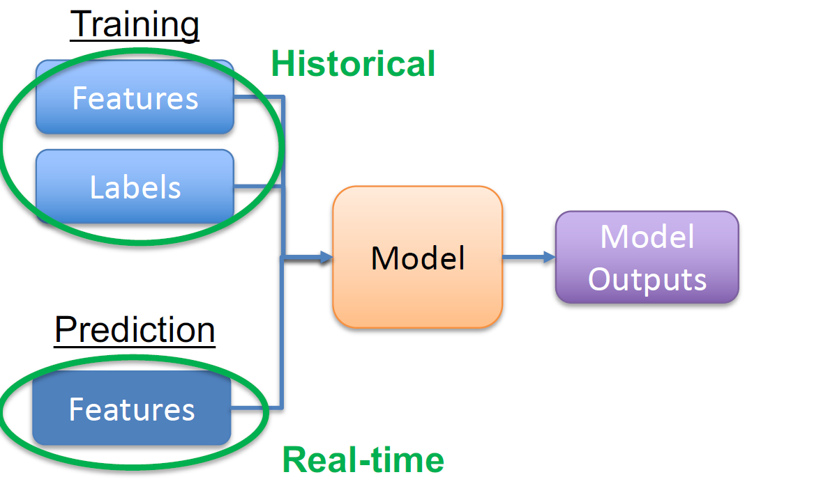

Plan and frame out a machine learning application project. 

1. Opportunity evaluation: the reason why virtual personalized wardrobe is an attractive use case for a ML-based solution is that it sits in the intersection of (3)
    --- the NEEDS for girls who cannot remember what pieces of cloth she already get in her wardrobe, and she is going for shopping, needs a good algorithm to generate a good combo to persuade her for buying a new piece that could match up with the one she already have
    --- the GIRLS in fashion cares!!!
    --- and ML can help with generating recommendation of styling based on personal taste.

-> focus groups: fashion girls
–> Identify pain points: want to scan new pieces and generate ootd to examine needs with already had ones
–> How are they solving it today: not covered, usually uploaded and generate
-> Is it feasible with ML? – Hard (Currently) but already solved (need improve tho)
-> Can we get data? we have it already from user uploading, and the online model cannot get it only run locally , and we have open source for training models (user also gonna add data to make the model fit their tastes )
-> Feasibility and Business impact: yes, the OOTD influencer could generate their vatar to share directly to social media, which could become a direct ads for more users.
-> convergency: converge when user use it more and have a stable tastes
-> mock-ups could be choosing 200 person and manually let them use the model to generate for free , and the only needs is to commit for 1 month and need feedbacks.

2. the Business Understanding phase of the CRISP-DM process for it:

    • Because it adds business value to users:
    – Automation
    – Prediction
    – Personalization (YES), why ML b/c can involve with re-training.

    --- define what success looks:
         outcome metrics: reduce the cloth of buy in by stating they cannot match with the one we already have
         output metrics:  MSE of matching rate lower tha 20%, A/B testing for different model / combos like match by similar or match by contrast
         
    --- identify relevant factors: 
         types of cloth (ie: t shirt, pants, belts, shoes, hats, ect.)
         materials
         couleur
         pattern
         design types/ labels .... 

3. validation plan for solution: 
    --- validating solution concept with potential users: 
            Significant missing data (ie:  materials , could be replaced as category best suggestion label ) 
    --- key ML system design architecture decisions:  
            Performance on test set(s) open sources
            Customer testing – live data from mock-ups users
    --- Sources of data
        Internal data (Log files , no user data for privacy )
        Internal operations & machinery (Sensors, cameras,Operational systems & hardware, Web data – forms, votes, ratings)
         External data (Weather, calendar, social media, etc.)

    --- Potential risks in production: 
        -> possible drift concerns: 
        -> other potential issues your model might encounter in production?
            --- Probabilistic rather than deterministic
                – How to define “good enough”
                – Art of model building
                – Variance of model outputs
            --- Higher technical risk
                – Data needs and quality
                – Model limitations: tastes could be wired and cannot generalized by common sense
    
4. Video records of the overview project: